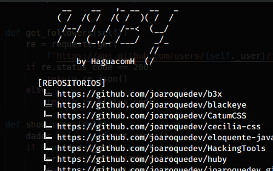
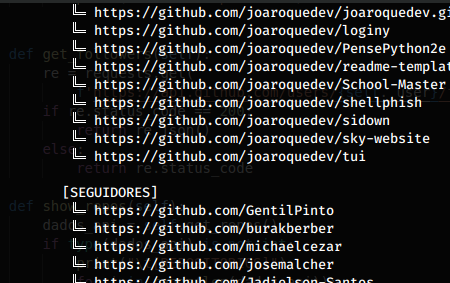

# Hubby
Consuming github api to see user information

> Simple...

Script building with python3. 

[Github-API](https://api.github.com)

## Require
* requests
* json

## Demo

 __Main__

## Meta

Joa Roque – [@joaroquedev](https://facebook.com/100025057463273) – haguacomh@gmail.com

[Joa Roque](https://github.com/joaroquedev)

[Programadore Angolano](https://www.programadorangolano.com)
